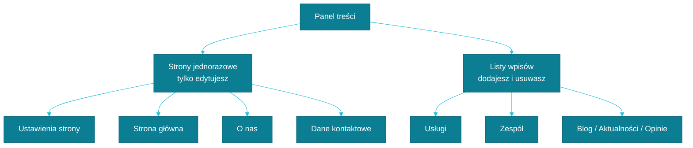

# Jedna strona czy lista wpisów?

To najważniejsza zasada rządząca całym panelem, więc zatrzymajmy się przy niej dłużej niż przy innych tematach. Każda pozycja w menu jest jednego z dwóch rodzajów, a pomylenie ich bywa źródłem większości pytań, z którymi się do nas zgłaszacie.

## Tabliczka na drzwiach

Wyobraź sobie tabliczkę z nazwą gabinetu przy wejściu. Możesz zmienić na niej napis, przewiesić ją inaczej, odświeżyć farbę — ale zawsze jest jedna, przy tych samych drzwiach. Nie zamawiasz drugiej tabliczki „na zapas” i nie da się jej po prostu zdjąć, zostawiając puste wejście.

Dokładnie tak działają w panelu **Ustawienia strony, Strona główna, Strona O nas, Strona Usług i Dane kontaktowe**. To pojedyncze dokumenty, które od początku istnieją i zawsze będą istnieć w jednym egzemplarzu. Otwierając je, nigdy nie zobaczysz przycisku „dodaj nowy” ani „usuń” — dla tego typu treści po prostu nie ma to zastosowania. Możesz je wyłącznie aktualizować.

## Segregator z aktami klientów

Zupełnie inaczej działa segregator z aktami klientów w kancelarii. Przyjmujesz nową sprawę — dokładasz nową teczkę. Sprawa się kończy i akta trafiają do archiwum — teczkę usuwasz albo odkładasz na bok. Segregator rośnie i kurczy się razem z Twoją praktyką.

Tak działają **Usługa, Członek zespołu** oraz, jeśli Twoja strona z nich korzysta, **Wpis na blogu, Aktualność i Opinia klienta**. To listy, do których swobodnie dodajesz nowe pozycje i z których usuwasz te nieaktualne. Zatrudniłeś/aś nowego prawnika do kancelarii? Dodajesz nowego Członka zespołu. Rozszerzyłeś/aś ofertę o mediacje? Dodajesz nową Usługę. Liczba pozycji na liście zależy wyłącznie od Ciebie.

## Dlaczego to rozróżnienie ma znaczenie

Jeśli szukasz sposobu na dodanie „drugiej strony głównej” albo zastanawiasz się, czemu nie da się usunąć Danych kontaktowych, to dlatego, że próbujesz zastosować logikę segregatora do tabliczki na drzwiach. Nie da się — i nie taki był zamysł. Te elementy mają być zawsze na miejscu, żeby strona nigdy nie została bez nagłówka czy adresu.

Z tym rozróżnieniem w głowie reszta panelu zaczyna się układać sama. Zobacz, jak to wygląda w praktyce przy dodawaniu nowej pozycji: [Usługa](./usluga.md).
