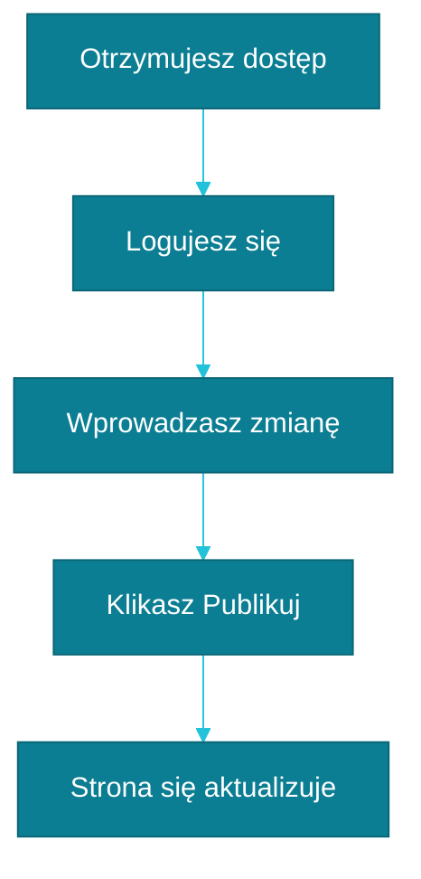

# Twoja pierwsza zmiana: jak sprawdzić, że wszystko działa

Najlepszy sposób, żeby uwierzyć, że panel naprawdę działa, to samodzielnie coś w nim zmienić i zobaczyć efekt na żywej stronie. Podpowiadamy, jak zrobić to bezpiecznie, na drobnym elemencie, który niczego nie zepsuje.

## Wybierz coś małego

Dobry pierwszy test to literówka w opisie usługi albo nieaktualny numer telefonu w danych kontaktowych — coś, co i tak warto poprawić, a jednocześnie łatwo cofnąć, gdyby coś poszło nie tak. Większe zmiany, jak usuwanie całych sekcji czy zdjęć, zostaw sobie na później, kiedy poczujesz się w panelu pewniej.

## Krok po kroku

1. Zaloguj się do panelu pod adresem, który od nas dostałeś.
2. Znajdź w treści element, który chcesz poprawić — na przykład opis usługi albo dane kontaktowe.
3. Kliknij w pole tekstowe i wprowadź zmianę.
4. Kliknij **Publikuj** w prawym górnym rogu ekranu.

Tyle z Twojej strony. Reszta dzieje się już bez Twojego udziału:

## Dlaczego trzeba chwilę poczekać

Kliknięcie „Publikuj” nie przenosi zmiany na stronę w tej samej sekundzie. W tle Twoja strona buduje się na nowo — trochę jak wypiek ciasta: składniki są już gotowe i wymieszane, ale ciasto i tak musi chwilę posiedzieć w piekarniku, zanim będzie gotowe do podania. W praktyce oznacza to zwykle od kilkudziesięciu sekund do kilku minut oczekiwania, zanim zmiana pojawi się na żywej stronie.

Jeśli po kilku minutach zmiana wciąż nie jest widoczna, odśwież stronę — czasem przeglądarka pokazuje starą, zapamiętaną wcześniej wersję — i dopiero wtedy napisz do nas.

Gdy ten pierwszy test się uda, wiesz już wszystko, co potrzebne, żeby samodzielnie aktualizować stronę. Zobacz, [co dalej](./co-dalej-po-starcie.md).
