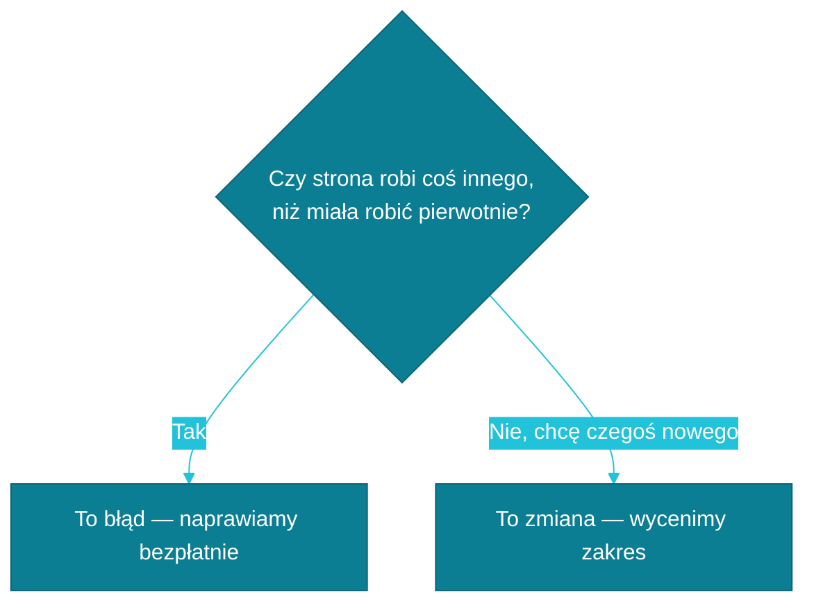

# Błąd czy nowa funkcja?

Kiedy coś na Twojej stronie zaczyna szwankować albo po prostu chcesz, żeby robiła coś więcej, pierwsze pytanie, jakie sobie zadajemy, brzmi: czy to błąd, czy to coś nowego? To rozróżnienie decyduje o tym, czy naprawa jest bezpłatna, czy wiąże się z osobną wyceną — dlatego zawsze wyjaśniamy je, zanim zabierzemy się do pracy.

## Czym jest błąd

Błąd to sytuacja, w której coś, co wcześniej działało — albo miało działać zgodnie z pierwotnym projektem strony — z jakiegoś powodu przestało. To nie jest Twoja wina i nie płacisz za to ani złotówki. **Błędy naprawiamy bezpłatnie**, bo dotyczą strony, którą dla Ciebie zbudowaliśmy i za którą odpowiadamy.

Weźmy konkretny przykład: prowadzisz kancelarię prawną, a formularz kontaktowy na Twojej stronie od tygodnia nie wysyła Ci e-maili z zapytaniami od klientów. Kiedyś działał, miał działać nadal — to klasyczny błąd. Zgłoś go, a my naprawimy go bez dodatkowych kosztów.

## Czym jest zmiana (Change Request)

Zmiana, po angielsku Change Request, to zupełnie inna sytuacja: nowa funkcja, inny układ treści albo pomysł, którego po prostu nie było w pierwotnym zakresie projektu. Nic się nie zepsuło — chcesz mieć coś, czego strona wcześniej nie miała.

Przykład: prowadzisz gabinet stomatologiczny i wpadasz na pomysł, żeby dodać zapis do newslettera z poradami dla pacjentów. Strona nigdy takiego formularza nie miała, więc to nie naprawa, tylko nowa funkcjonalność. Zanim ruszymy z pracą, wycenimy zakres i ustalimy, ile czasu to zajmie.

## Jak to szybko rozróżnić

Jeśli nie masz pewności, do której kategorii pasuje Twoje zgłoszenie, wystarczy odpowiedzieć sobie na jedno pytanie: czy strona robi coś innego, niż miała robić pierwotnie?

Jeśli mimo to nie masz pewności, nie zastanawiaj się zbyt długo — po prostu do nas napisz. Sami ocenimy sytuację i powiemy wprost, z którym przypadkiem mamy do czynienia.

---

Chcesz wiedzieć dokładnie, co jeszcze obejmuje opieka nad stroną, a co jest już osobno płatne? Sprawdź: [Co wchodzi w opiekę, a co jest płatne dodatkowo](./co-wchodzi-w-opieke.md)
