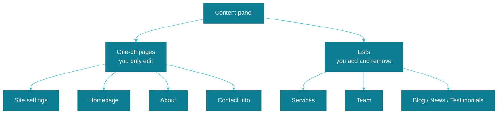

# One page, or a list of entries?

This is the single most important rule behind the whole panel, so let's slow down here more than anywhere else. Every item in the menu belongs to one of two kinds, and mixing them up is behind most of the questions we get from clients.

## The nameplate on the door

Picture the nameplate with your practice's name by the entrance. You can change the text on it, hang it slightly differently, repaint it — but there's always exactly one, at the same door. You don't order a spare one "just in case," and you can't simply take it down and leave an empty entrance.

That's exactly how **Site Settings, Homepage, About, Services Page, and Contact Info** work in the panel. These are single documents that have always existed, and always will, as one copy. Open any of them and you'll never see an "add new" or "delete" button — for this kind of content, those simply don't apply. You can only ever update them.

## The binder of client files

A binder of client files at a law firm works completely differently. You take on a new case — you add a new folder. A case closes and the file goes to the archive — you remove the folder, or set it aside. The binder grows and shrinks along with your practice.

That's how **Service, Team Member**, and, if your site uses them, **Blog Post, News Item, and Testimonial** work. These are lists you freely add entries to and remove outdated ones from. Hired a new associate at the firm? You add a new Team Member. Expanded your offering to include mediation? You add a new Service. How many entries end up on the list is entirely up to you.

## Why this distinction matters

If you're looking for a way to add a "second homepage," or wondering why you can't delete Contact Info, it's because you're trying to apply binder logic to a nameplate. It can't be done — and it was never meant to be. These elements are designed to always be in place, so the site is never left without a heading or an address.

With this distinction in mind, the rest of the panel starts to fall into place on its own. See how it plays out in practice when adding a new entry: [Service](./usluga.md).
