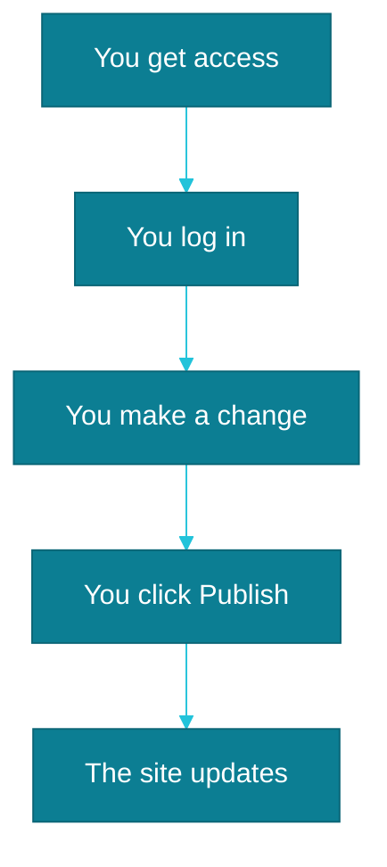

# Your first change: how to confirm everything works

The best way to believe the panel actually works is to change something in it yourself and watch it show up on the live site. Here's how to do that safely, on something small enough that nothing can go wrong.

## Pick something small

A good first test is a typo in a service description, or an outdated phone number in your contact details — something worth fixing anyway, and easy to undo if anything looks off. Save bigger changes, like removing whole sections or photos, for later, once you feel more confident in the panel.

## Step by step

1. Log in to the panel at the address we gave you.
2. Find the piece of content you want to fix — a service description or your contact details, for example.
3. Click into the text field and make your change.
4. Click **Publish** in the top right corner of the screen.

That's all on your end. Everything after that happens without you:

## Why you need to wait a moment

Clicking "Publish" doesn't move your change onto the site in the same second. Behind the scenes, your site rebuilds itself — a bit like baking a cake: the ingredients are mixed and ready, but the cake still needs a few minutes in the oven before it's ready to serve. In practice that usually means anywhere from a few dozen seconds to a few minutes before the change shows up live.

If it's still not visible after a few minutes, refresh the page — sometimes your browser is just showing an older, cached version — and only get in touch with us after that.

Once this first test works, you already know everything you need to keep the site updated on your own. See [what's next](./co-dalej-po-starcie.md).
