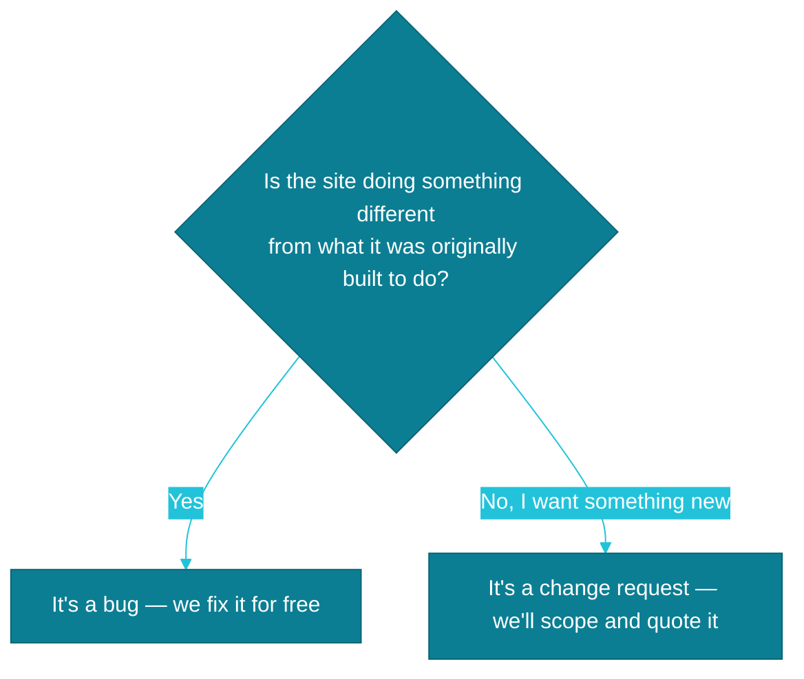

# Bug or new feature?

When something on your site starts acting up, or you simply want it to do more, the first question we ask ourselves is: is this a bug, or is it something new? That distinction decides whether the fix is free or needs a separate quote — so we always sort it out before we start any work.

## What counts as a bug

A bug is when something that used to work — or was supposed to work according to the site's original design — stops working for some reason. That's not on you, and you don't pay a cent for it. **We fix bugs for free**, because they concern the site we built and remain responsible for.

Here's a concrete example: you run a law firm, and the contact form on your site has stopped sending you email notifications about client inquiries for a week now. It used to work, and it's supposed to keep working — that's a textbook bug. Report it, and we'll fix it at no extra cost.

## What counts as a change request

A change request is a different situation entirely: a new feature, a different layout, or an idea that simply wasn't part of the original project scope. Nothing broke — you just want something the site never had before.

Example: you run a dental practice, and you get the idea to add a newsletter sign-up with tips for patients. The site never had that form, so this isn't a repair — it's new functionality. Before we start building, we'll scope it and give you a quote for the time it takes.

## A quick way to tell the difference

If you're not sure which category your request falls into, one question usually settles it: is the site doing something different from what it was originally built to do?

If you're still not sure, don't overthink it — just send us a message. We'll take a look and tell you plainly which situation you're dealing with.

---

Want to know exactly what else is included in ongoing support, and what's billed separately? Check out: [What's included in ongoing support, and what's billed separately](./co-wchodzi-w-opieke.md)
